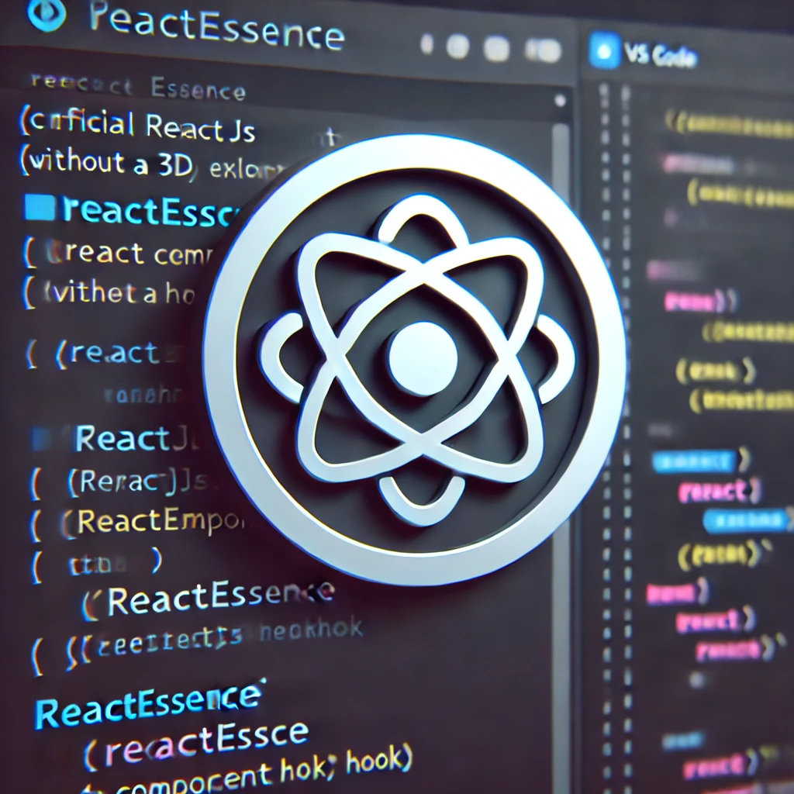
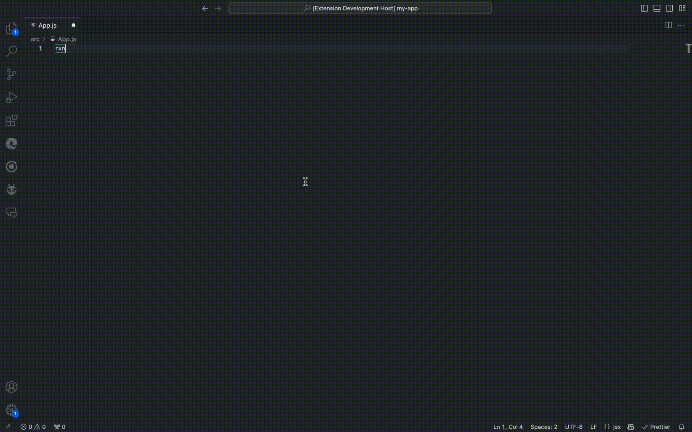
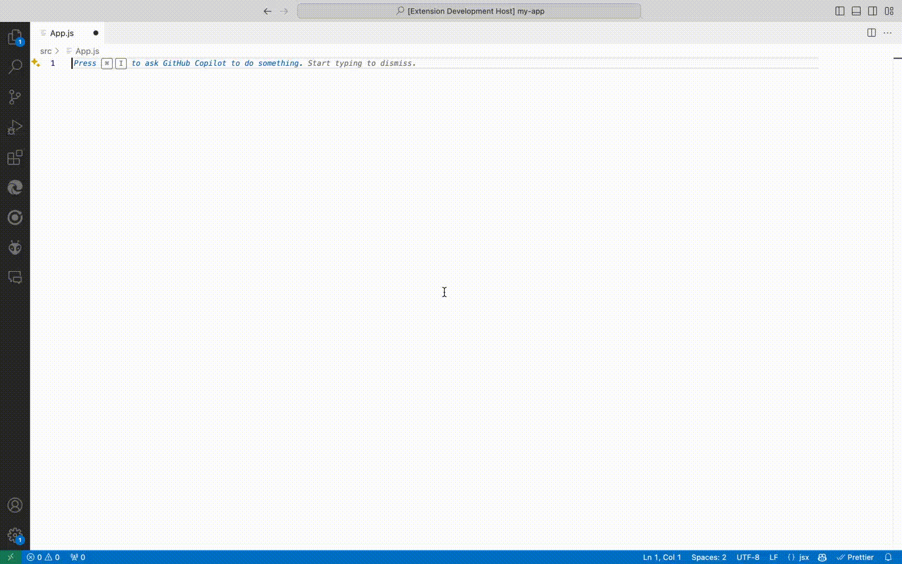

# ReactEssence



[](https://github.com/sitharaj88/react-essence/releases)
[](https://opensource.org/licenses/MIT)
[](https://github.com/sitharaj88/react-essence/issues)
[](https://github.com/sitharaj88/react-essence/network/members)
[](https://github.com/sitharaj88/react-essence/stargazers)

**ReactEssence** is your ultimate VS Code companion for ReactJS development. Elevate your productivity with tailored snippets, precise syntax highlighting, and streamlined coding practices. Whether you're building complex UIs or simple components, ReactEssence enhances your workflow with modern React features.

## 🚀 Features

- 🌟 **Rich Snippets**: Instantly generate React components, hooks, and other common patterns.
- 🎨 **Syntax Highlighting**: Enhanced visual cues for `.js` and `.jsx` files with embedded JSX.
- 🔄 **Auto-Completion**: Smart auto-completion for brackets, quotes, and JSX tags.
- 🛠 **Customizable**: Easily extend or modify snippets and settings to suit your coding style.
- 🔍 **Focused Development**: Keep your codebase clean and efficient with best practices baked into the snippets.

## 🎥 Preview

### Dark Theme



### Light Theme



## 🛠 Installation

1. **Install via VS Code Marketplace**: Search for "ReactEssence" in the Extensions view (`Ctrl+Shift+X`).
2. **Manual Installation**:
   - Download and install the `.vsix` file from the [Releases](https://github.com/sitharaj88/react-essence/releases) page.
3. **Reload VS Code**: Restart VS Code to activate the extension.

## 💡 Usage

Start typing any of the following prefixes to trigger the snippets:

- `rxn-class`: Quickly scaffold a React class component.
- `rxn-func`: Generate a functional component in seconds.
- `rxn-usestate`: Add a `useState` hook with a default value.
- `rxn-useeffect`: Integrate the `useEffect` hook for side effects.
- `rxn-context-provider`: Set up a React Context provider with ease.

For a full list of available snippets and their usage, refer to the [Snippets Documentation](docs/snippets.md).

## 📝 Snippets Showcase

```javascript
import React, { useState, useEffect } from 'react';

const MyComponent = () => {
  const [count, setCount] = useState(0);

  useEffect(() => {
    document.title = `You clicked ${count} times`;
  }, [count]);

  return (
    <div>
      <p>You clicked {count} times</p>
      <button onClick={() => setCount(count + 1)}>Click me</button>
    </div>
  );
};

export default MyComponent;
```

## 🚧 Roadmap

- [ ] Add more advanced React snippets (e.g., custom hooks, HOCs).
- [ ] Integrate with popular CSS-in-JS libraries for styled components.
- [ ] Provide TypeScript support and additional typings for snippets.
- [ ] Create an interactive snippet explorer within VS Code.

## 🐞 Issues & Contributions

We welcome contributions! If you have suggestions, improvements, or bug reports, please [open an issue](https://github.com/sitharaj88/react-essence/issues) or submit a pull request.

## 📄 License

This project is licensed under the MIT License - see the [LICENSE](LICENSE) file for details.

---

Made with ❤️ by [Sitharaj Seenivasan](https://github.com/sitharaj88)
